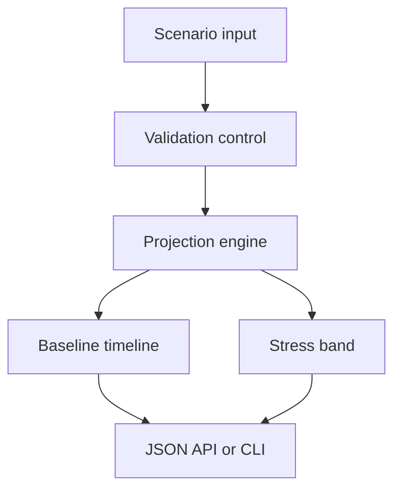

# 🟠 The Orange House

**Privacy-first economic intelligence and scenario planning for the XUNIA ecosystem.**

This first functional projection models transparent treasury or resource scenarios without connecting to wallets, placing trades, moving funds, or storing personal data.

> Scenario output is educational planning data—not financial advice or a market forecast.

## macOS: first launch in one paste

Run this from any folder. It clones the repository if missing, updates it if present, enters the correct folder, and starts the API with the Python command macOS provides:

```bash
cd "$HOME" && { test -d theorangehouse/.git && git -C theorangehouse pull --ff-only || git clone https://github.com/sonoxo/theorangehouse.git; } && cd theorangehouse && ./orangehouse.command serve
```

Then open [http://127.0.0.1:8080/health](http://127.0.0.1:8080/health). Stop the server with `Control-C`.

## Run a projection

From the repository folder:

```bash
./orangehouse.command project 10000 --monthly-flow 500 --annual-rate 0.05 --volatility 0.15 --months 24
```

The launcher automatically chooses `python3` or `python` and refuses unsupported Python versions.

## API

```bash
curl -s http://127.0.0.1:8080/v1/project -H 'content-type: application/json' -d '{"starting_value":10000,"monthly_flow":500,"annual_rate":0.05,"volatility":0.15,"months":24}'
```

| Route | Purpose |
|---|---|
| `GET /health` | Runtime heartbeat |
| `GET /ontology` | Semantic entities and relations |
| `POST /v1/project` | Baseline plus low/high stress band |

## Architecture



## Controls

- Local-first, dependency-free runtime
- No wallet keys, custody, trading, or transaction signing
- Strict request-size and field validation
- Deterministic, reproducible output
- Non-root Docker runtime and automated tests

## Verify

```bash
./orangehouse.command test
```

Historic Monero meta documents remain as upstream reference material. New components live under `orangehouse/`, `ontology/`, `tests/`, and `.github/workflows/`.
